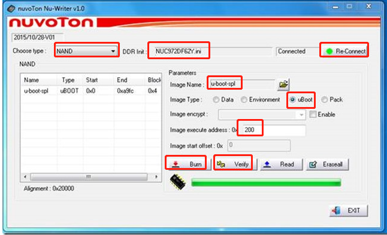
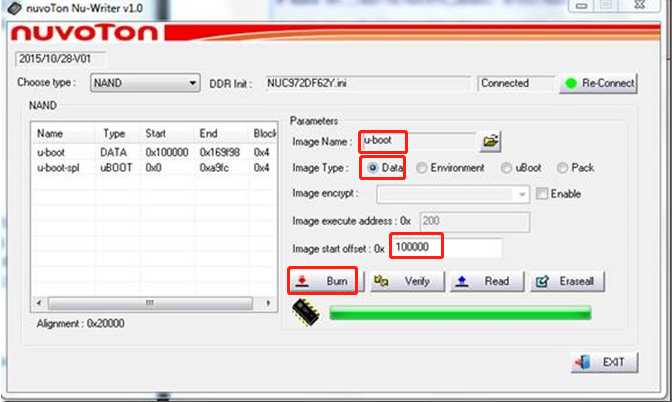
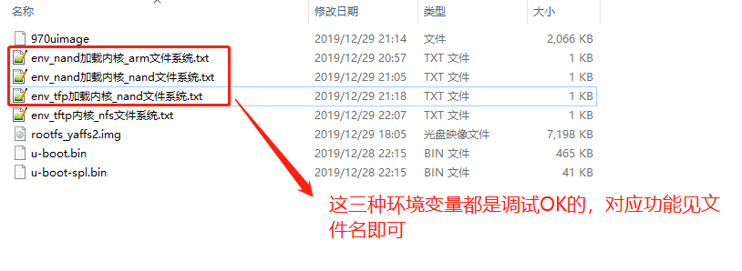
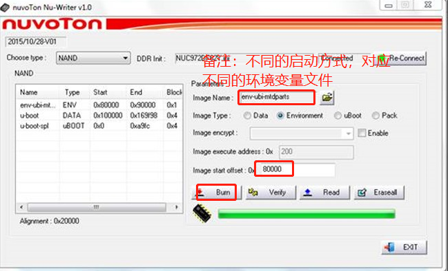
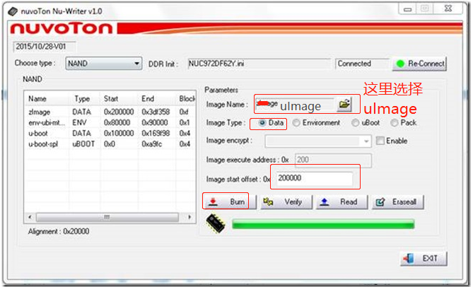
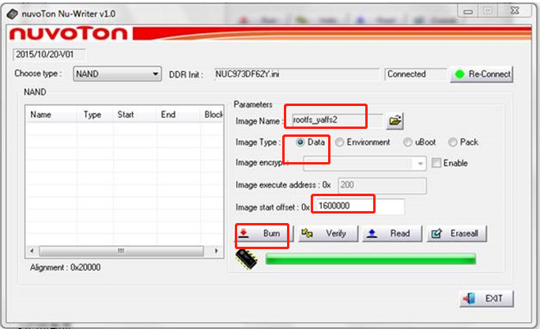

# NuWriter.exe下载运行

## 烧录u-boot-spl.bin

u-boot-spl.bin负责将u-boot.bin从Nand flash搬到DDR中执行。默认执行地址：0x200，可修改;

> 

## 烧录u-boot.bin

u-boot程序，默认执行地址：0xE00000，在nand flash中的烧写地址：0x100000;

> 

## 烧录环境变量env.txt

u-boot环境变量，在Nand Flash中的烧写地址：0x80000;

不同的启动方式对应不同的环境变量设置，目前支持以下三种环境变量：

> 

烧录地址截图如下

> 

## 烧录内核文件uImage

Linux kernel,加载地址：0x7fc0；执行地址：0x8000；烧写地址：0x200000，可变要与u-boot环境参数一致，bootcmd=nboot 0x7fc0 0 0x200000;bootm 0x7fc0.

> 

## 烧录文件系统rootfs_yaffs2.img

文件系统，烧录地址是0x1600000

> 