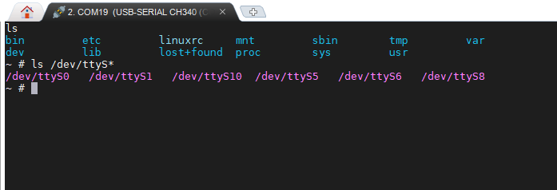
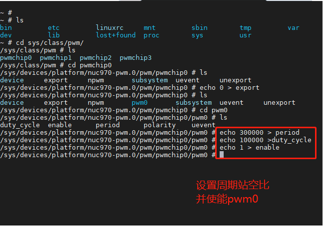
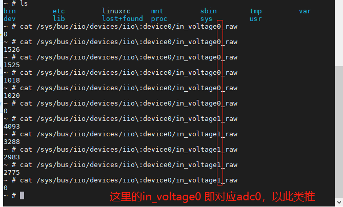
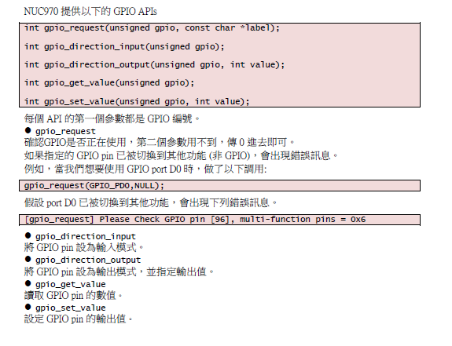
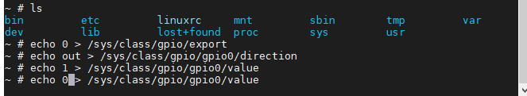
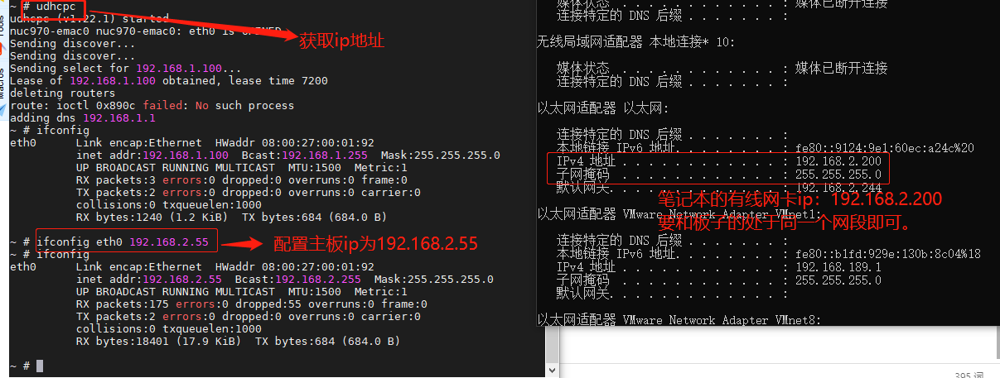
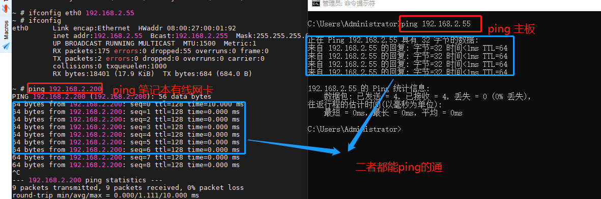
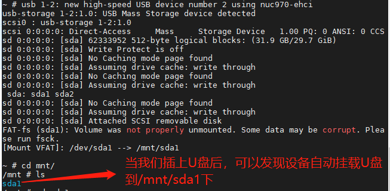

# 测试外设

## 串口测试

启动开发板，`ls /dev/ttyS*`  可以看到目前设备的串口0、1、5、6、8和10是打开的，其中串口0默认是调试串口。



下面以串口1为例说明串口测试方法：

```
~ # cat /dev/ttyS1 &
~ # echo hello uart1 > /dev/ttyS1
```

执行以上代码就可以往串口1发数据，用户只需通过串口助手软件观察uart1发过来的的数据即可，且用户还可以向uart1发送数据，那么在linux终端就可以看到收到的数据。同理别的串口也可以这样简单测试。

## pwm 测试

启动开发板后，执行以下命令即可

```
~ # ls
bin         etc         linuxrc     mnt         sbin        tmp         var
dev         lib         lost+found  proc        sys         usr
~ # cd sys/class/pwm/
/sys/class/pwm # ls
pwmchip0  pwmchip1  pwmchip2  pwmchip3
/sys/class/pwm # cd pwmchip0
/sys/devices/platform/nuc970-pwm.0/pwm/pwmchip0 # ls
device     export     npwm       subsystem  uevent     unexport
/sys/devices/platform/nuc970-pwm.0/pwm/pwmchip0 # echo 0 > export
/sys/devices/platform/nuc970-pwm.0/pwm/pwmchip0 # ls
device     export     npwm       pwm0       subsystem  uevent     unexport
/sys/devices/platform/nuc970-pwm.0/pwm/pwmchip0 # cd pwm0
/sys/devices/platform/nuc970-pwm.0/pwm/pwmchip0/pwm0 # ls
duty_cycle  enable      period      polarity    uevent
/sys/devices/platform/nuc970-pwm.0/pwm/pwmchip0/pwm0 # echo 300000 > period
/sys/devices/platform/nuc970-pwm.0/pwm/pwmchip0/pwm0 # echo 100000 >duty_cycle
/sys/devices/platform/nuc970-pwm.0/pwm/pwmchip0/pwm0 # echo 1 > enable

```



其中参数如下：

| 文件名称   | 作用                                        |
| ---------- | ------------------------------------------- |
| period     | 周期 单位为ns                               |
| duty_cycle | 设置占空比 单位ns                           |
| polarity   | 相位                                        |
| enable     | 使能或者禁能 例如 `echo 1> enable` 使能输出 |

## adc测试

启动开发板后，执行以下命令即可

```
~ # cat /sys/bus/iio/devices/iio\:device0/in_voltage0_raw
```




## gpio测试



用户可以通过`/sys/class/gpio`来编程普通GPIO程序,下面示例是设置PA0 为方向输出，先输出1再输出0。



## 网络测试

设置如下：



然后主板 `ping 192.168.2.200`，笔记本` ping 192.168.2.55` ，最终执行结果如下图，说明二者网络互通。



## USB测试

