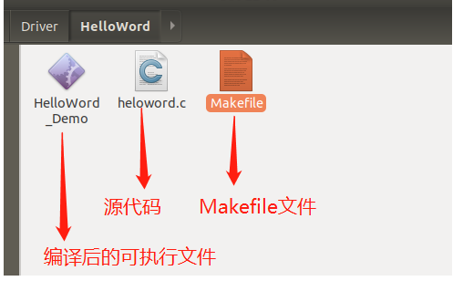
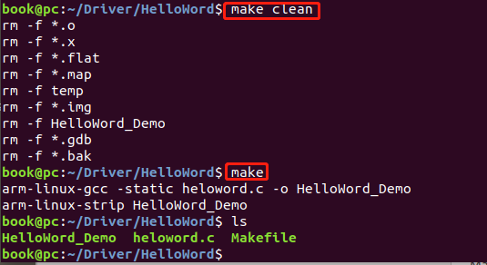
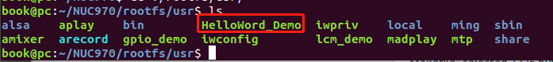
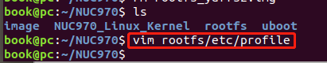
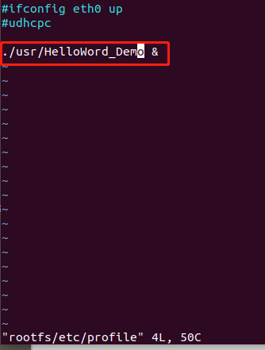
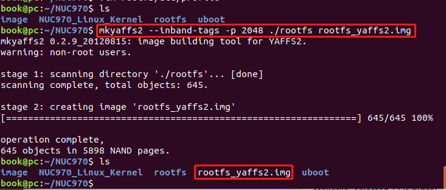
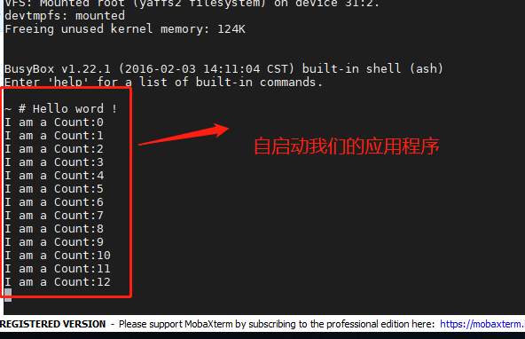

# 添加自启动应用程序

### 编译应用程序

这里假如客户的应用程序是HelloWord_Demo程序,工程目录如所示：



其中heloword.c是源程序，内容如下：

```

#include <string.h>
#include <stdio.h>
#include <stdlib.h>
#include <unistd.h>


int main(void)
{
	unsigned long i=0;
	printf("Hello word !\r\n");
	while(1){
		printf("I am a Count:%d\r\n",i++);
		sleep(1);
	}
	return 0;
}
```

Makefile内容如下：

```
.SUFFIXES : .x .o .c .s

CC := arm-linux-gcc
STRIP := arm-linux-strip

TARGET = HelloWord_Demo
SRCS := heloword.c

all: 
	$(CC) -static $(SRCS) -o $(TARGET)
	$(STRIP) $(TARGET) 

clean:
	rm -f *.o 
	rm -f *.x 
	rm -f *.flat
	rm -f *.map
	rm -f temp
	rm -f *.img
	rm -f $(TARGET)	
	rm -f *.gdb
	rm -f *.bak
```

生成可执行文件：切换到工程目录执行：

```
make clean
make
```

如图所示



拷贝可执行文件到文件系统/usr目录

```
cp HelloWord_Demo ~/NUC970/rootfs/usr/
```

拷贝完后图所示：



## 修改开机启动脚本

执行如下命令，修改开机脚本

```
book@pc:~/NUC970$ vim rootfs/etc/profile
```

如图所示：



修改完后的内如图所示：




## 打包文件系统

执行以下命令打包文件系统

```
book@pc:~/NUC970$ mkyaffs2 --inband-tags -p 2048 ./rootfs rootfs_yaffs2.img
```

如图所示：



打包完后生成 rootfs_yaffs2.img文件系统镜像文件，下载到开发板0x1600000地址即可。

## 验证

烧录完后，启动开发板，可以看到刚刚编译的HelloWord_Demo程序已经自己启动运行起来了。



***备注：***HelloWord_Demo应用程序代码下载地址：

链接：https://pan.baidu.com/s/1axdLazE-KyEauTbIx3D0GQ 
提取码：oscm 