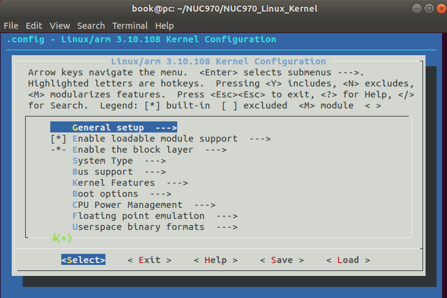
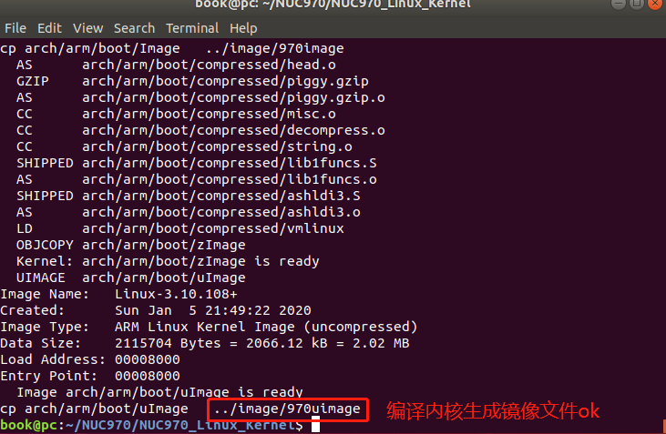
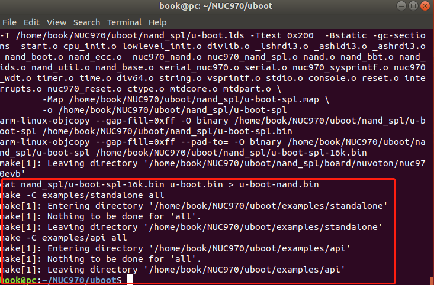
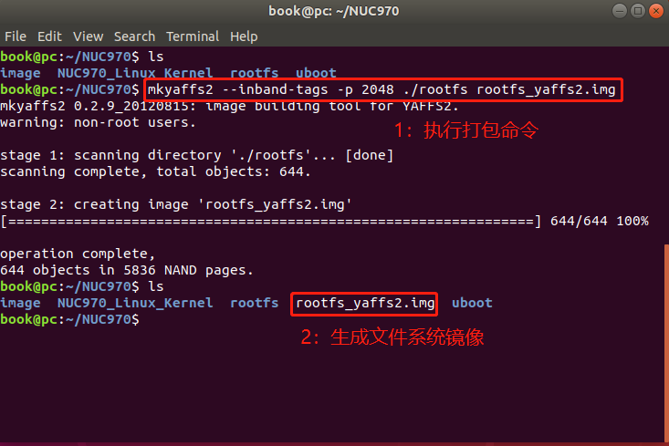

## 编译内核


1. 切换到内核所在目录 

   ```shell
   cd ~/NUC970/NUC970_Linux_Kernel/
   ```

2. 如需配置内核选项，请执行以下命令，否则直接跳过该命令

   ```shell
   make menuconfig
   ```

   

3. 编译内核生成镜像文件uImage

   ```
   make uImage
   ```

   执行完后，如果有下图指示，说明编译内核成功

   

4. 最终生成的镜像文件uImage在以下目录

   ```shell
   /home/book/NUC970/image
   ```


## 编译uboot


1. 切换到uboot目录

   ```shell
   cd ~/NUC970/uboot/
   ```

   

2. 如需配置uboot，执行以下命令，进行配置。配置文件位于uboot/include/configs/nuc970_evb.h文件进行配置，否则跳过该命令

   ```shell
    book@pc:~/NUC970/uboot$ vim include/configs/nuc970_evb.h 
   ```

   

3. 编译uboot

   ```shell
   book@pc:~/NUC970/uboot$ make all
   ```

   如果出现以下界面，证明编译uboot成功。

   


4. 最终生成的镜像文件uboot_spl.bin和uboot.bin分别在以下目录

```
  /home/book/NUC970/uboot/nand_spl/
  /home/book/NUC970/uboot/
```


## 打包文件系统

执行以下命令打包文件系统

```shell
book@pc:~/NUC970$ mkyaffs2 --inband-tags -p 2048 ./rootfs rootfs_yaffs2.img
```

如果出现以下界面，证明打包成功。




## 总结

本章节主要编译源码生成可执行文件，为下载到主板做准备，主要文件如下：

1. bootload文件 ：uboot_spl.bin 和 uboot.bin
2. linux内核镜像文件：uImage
3. 文件系统镜像文件：rootfs_yaffs2.img

请把以上文件拷贝到windows下，准备烧录。