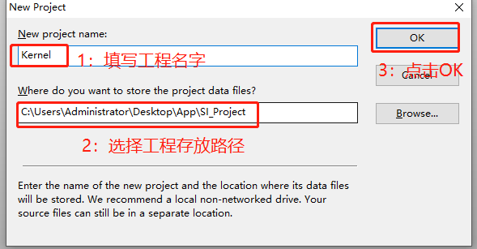
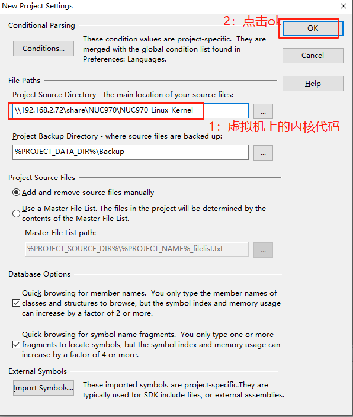
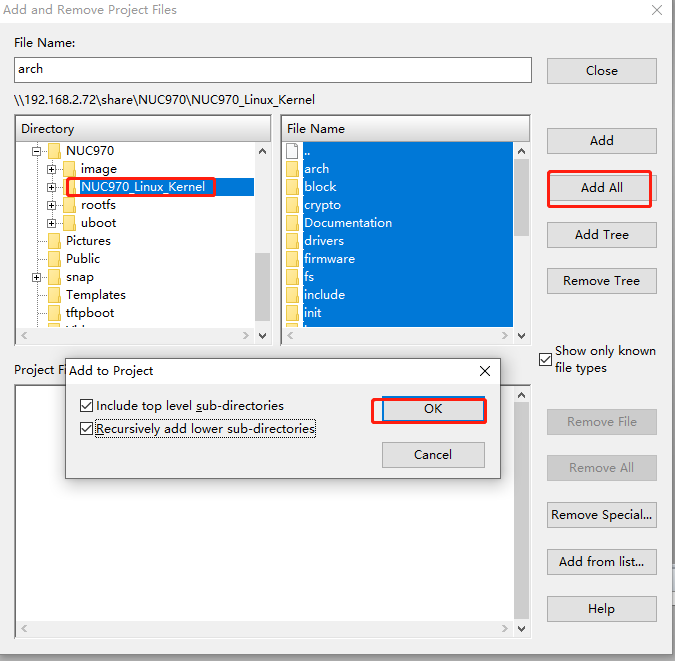
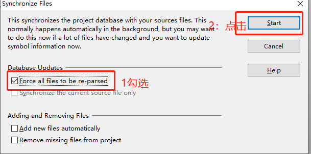

# Windows下基于Source Insight

### 访问samb服务器

由于ubuntu已经打安装samba服务器，用户只需在windows下【我的电脑】空白处右键，选择【添加一个网络位置】-》【下一步】-》【下一步】输入以下命令，其中192.168.2.102是虚拟机的IP地址。

```
\\192.168.2.102\share
```

这个时候已经可以访问虚拟机里面的共享文件夹\home\book\里面的所有东西了。

### windows下安装Sources Insight4.0软件

牵扯到版权问题，请用户自行安装。

### 新建Sources Insight内核工程

1. 在电脑新建文件夹，命名为SI_Project（随便命名），打开Sources Insight4.0-》【Project】-》【New Project】，在弹出的New Project选项卡里面填写自己的工程名字和工程存放路径，这里路径我们选择刚刚创建的SI_Project文件夹

   

2. 选择源码目录

   

3. 添加内核源码到工程，用户可以自行选择需要把哪些源码加入到工程。

   

4. 【Project】-》【Synchronize Files】

   

   等待同步完成即可。

### 添加自己应用文件

接着我们可以在samb共享目录下存放自己的应用程序，然后同步到source Insight工程，在编写代码的时候，就可以自动找到需要的内核代码，方便补全提示等等。因为内核源码和自己的工程文件都是ubuntu下，windows下只是通过samb服务器访问而已，所以修改完后直接在ubuntu下编译即可，不用再来回拷贝。


